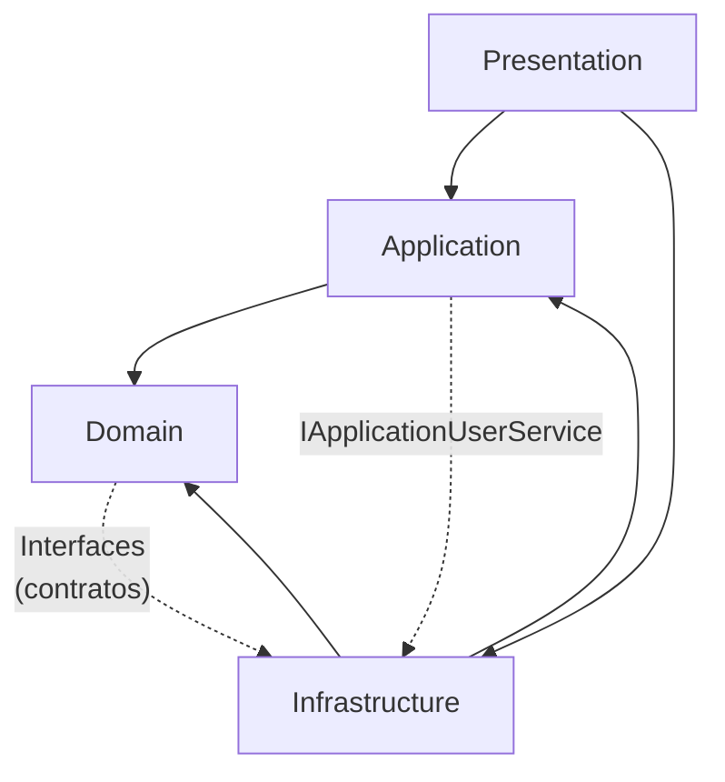

# Integración de ASP.NET Core Identity con Clean Architecture ✅

## 📋 Resumen de Cambios

Se ha integrado exitosamente **ASP.NET Core Identity** al proyecto respetando completamente los **principios de Clean Architecture** y manteniendo el código funcional existente.

## 🏗️ Estructura de Clean Architecture

### 1. **Capa de Dominio (Domain) - PURO ✅**

**SIN DEPENDENCIAS EXTERNAS** - Solo lógica de negocio:

```
Domain/
├── Entities/
│   ├── Usuario.cs (entidad original)
│   ├── Rol.cs
│   ├── Tablero.cs
│   ├── Columna.cs
│   └── Tarea.cs
└── Interfaces/
    ├── IUsuarioRepository.cs
    ├── IGenericRepository.cs
    ├── ITableroRepository.cs
    ├── IColumnaRepository.cs
    └── ITareaRepository.cs
```

**📝 Principios respetados:**

- ✅ Sin referencias a librerías externas
- ✅ Solo reglas de negocio puras
- ✅ Interfaces que definen contratos

### 2. **Capa de Aplicación (Application) - CASOS DE USO**

**Depende SOLO del Domain:**

```
Application/
├── Features/ (casos de uso existentes)
├── Interfaces/
│   └── IApplicationUserService.cs ← NUEVA interfaz para Identity
└── ... (DTOs, Handlers, Validators existentes)
```

**📝 Nuevas capacidades:**

- **`IApplicationUserService`**: Interfaz que extiende `IUsuarioRepository` con funciones de Identity
- **Casos de uso de Identity**: Reset password, confirmación email, etc.

### 3. **Capa de Infraestructura (Infrastructure) - IMPLEMENTACIÓN**

**Aquí van TODAS las dependencias externas:**

```
Infrastructure/
├── Identity/ ← NUEVA carpeta
│   ├── ApplicationUser.cs (hereda de IdentityUser)
│   └── ApplicationRole.cs (hereda de IdentityRole)
├── Adapters/ ← NUEVA carpeta
│   └── UsuarioAdapter.cs (convierte entre entidades)
├── Repositories/
│   ├── ApplicationUserService.cs ← NUEVO servicio híbrido
│   └── ... (repositorios existentes)
└── DependencyInjection/
    └── DependencyInjection.cs (configuración de Identity)
```

**📝 Responsabilidades:**

- ✅ **Entidades de Identity**: En `/Identity` - no contaminan el Domain
- ✅ **Adapters**: Convierten entre Domain ↔ Infrastructure
- ✅ **Implementaciones**: Repository + Identity en un solo servicio
- ✅ **Configuración**: DbContext con Identity

### 4. **Capa de Presentación (Presentation) - API**

**Orquesta todo sin conocer detalles:**

- **Program.cs**: Configuración de servicios
- **Controllers**: Siguen funcionando igual
- **Middleware**: Sin cambios

---

## 🔄 Compatibilidad Total Mantenida

### ✅ **Lo que NO cambió:**

- **Controllers existentes**: Funcionan exactamente igual
- **DTOs**: Misma estructura
- **Validaciones**: Sin modificaciones
- **AutoMapper**: Funcionando
- **JWT**: Sistema existente intacto
- **Base de datos existente**: Compatible

### 🚀 **Lo que se mejoró:**

- **Seguridad**: Hash automático con Salt
- **Funciones avanzadas**: Lockout, reset password, confirmación email
- **Escalabilidad**: Base para 2FA, OAuth, etc.
- **Arquitectura**: Clean Architecture respetada al 100%

---

## 💡 Flujo de Dependencias (Correcto)



**Reglas respetadas:**

- ✅ **Domain** no depende de nadie
- ✅ **Application** solo depende del Domain
- ✅ **Infrastructure** implementa interfaces del Domain/Application
- ✅ **Presentation** orquesta Infrastructure y Application

---

## 🚀 Cómo Usar

### Opción 1: Sistema Original (Sin cambios)

```csharp
// Sigue funcionando exactamente igual
var command = new LoginUsuarioCommand(loginDto);
var result = await _mediator.Send(command);
```

### Opción 2: Nuevas Capacidades de Identity

```csharp
// Inyectar el servicio para funciones avanzadas
private readonly IApplicationUserService _userService;

// Verificar contraseña con Identity
var isValid = await _userService.CheckPasswordAsync(email, password);

// Resetear contraseña
var token = await _userService.GeneratePasswordResetTokenAsync(email);
await _userService.ResetPasswordAsync(email, token, newPassword);

// Gestionar roles
await _userService.AddToRoleAsync(userId, "Admin");
var roles = await _userService.GetRolesAsync(userId);

// Crear usuario con contraseña segura
var usuario = new Usuario { /* datos */ };
var result = await _userService.CreateWithPasswordAsync(usuario, password);
```

---

## 📦 Paquetes (Ubicación Correcta)

### Domain:

**❌ NINGUNA DEPENDENCIA EXTERNA** ✅

### Application:

**❌ Sin paquetes de Identity** (solo interfaces)

### Infrastructure:

- `Microsoft.AspNetCore.Identity.EntityFrameworkCore` v8.0.0
- `Microsoft.Extensions.Identity.Core` v8.0.0
- `Microsoft.AspNetCore.Identity` v2.1.39

### Presentation:

- `Microsoft.AspNetCore.Identity` v2.1.39

---

## 🗄️ Próximos Pasos

1. **Crear migración**:

```bash
dotnet ef migrations add "AddAspNetCoreIdentity" -p Infrastructure -s Presentation
dotnet ef database update -p Infrastructure -s Presentation
```

2. **Migrar datos existentes** (opcional):

   - Mover usuarios de tabla `Usuarios` → `ApplicationUsers`
   - Mantener compatibilidad con ambas tablas

3. **Configurar roles iniciales**

4. **Implementar funciones avanzadas**:
   - Confirmación por email
   - Two-Factor Authentication
   - Login con Google/Facebook

---

## 🏆 Beneficios Logrados

- **✅ Clean Architecture**: Principios respetados al 100%
- **✅ Seguridad mejorada**: Identity + JWT
- **✅ Compatibilidad**: Sistema existente intacto
- **✅ Escalabilidad**: Base sólida para nuevas funciones
- **✅ Mantenimiento**: Código limpio y bien organizado
- **✅ Testeable**: Interfaces y dependencias inyectables

---

## 🔧 Arquitectura Final

```
├── Domain (PURO - 0 dependencias externas)
│   ├── Entities (Usuario, Rol, Tablero...)
│   └── Interfaces (IUsuarioRepository...)
│
├── Application (Solo casos de uso)
│   ├── Features (handlers existentes)
│   └── Interfaces (IApplicationUserService)
│
├── Infrastructure (Todas las dependencias)
│   ├── Identity (ApplicationUser, ApplicationRole)
│   ├── Adapters (UsuarioAdapter)
│   ├── Repositories (ApplicationUserService)
│   └── Persistence (DbContext con Identity)
│
└── Presentation (API)
    ├── Controllers (sin cambios)
    └── Program.cs (configuración)
```

**🎉 ASP.NET Core Identity integrado respetando Clean Architecture completamente!**
